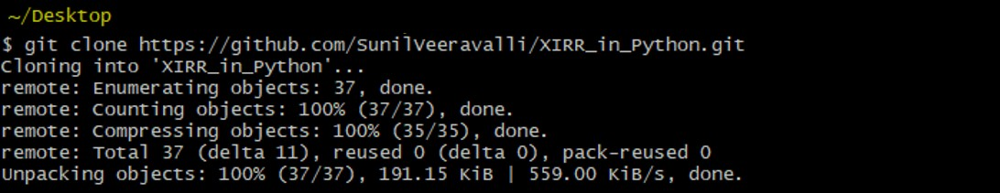
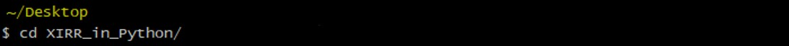
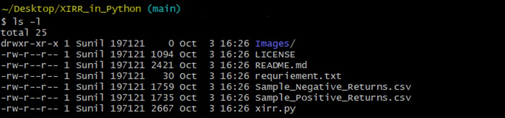
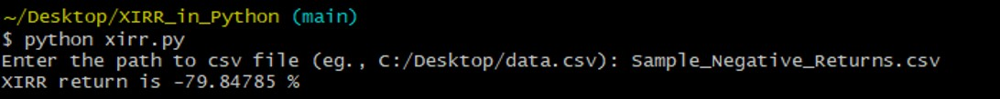

XIRR calculation (in Python)
=============================

Introduction
============

XIRR stands for Extended Internal Rate of Return and is used to calculate return on investments made at different time periods which need not be periodic.

XIRR gives the annualized return of a portfolio that include all cash flows.

XIRR is a financial function available in Excel. The drawback with Excel's XIRR is that it will show the 0% XIRR as a default for negative returns.

For use in Python, I have written this code which calculates XIRR for both positive and negative returns. For the same XIRR calculation using R, please check my other repository: [**XIRR_in_R**](https://github.com/SunilVeeravalli/XIRR_in_R)

I hope you find my xirr function useful.

Sample test Data
-----------------
<pre>
Data should be in a csv file and should have two columns:  
    1. Date of transaction  
    2. Transaction amount where purchases (debit) should be a negative number and the redemptions (credit) should be a positive number.
        dates      amount
        23/03/1990  -1350
        23/07/1990    600
        31/10/1990  -1250
        13/11/1990   3550
        30/01/1991   -850
        03/05/1991   3600
</pre>

Note: Please find the sample data provided in the repository

-   [Sample\_Positive\_Returns.csv](https://github.com/SunilVeeravalli/XIRR_in_Python/blob/main/Sample_Positive_Returns.csv)
-   [Sample\_Negative\_Returns.csv](https://github.com/SunilVeeravalli/XIRR_in_Python/blob/main/Sample_Negative_Returns.csv)

System requirements
-------------------
1.  Python (version 3.8.2)
2.  Libraries: Pandas, Numpy

I am using git terminal (CLI) to execute the script.  
Clone the repository onto your system from github.

Move into the cloned folder.  

View the list of files and folders.  

Example: Positive returns
-------------------------
Pass the location of Sample\_Positive\_Returns.csv

That is, the return of our portfolio is **17.425%** per annum.

Example: Negative returns
-------------------------
Pass the location of Sample\_Negative\_Returns.csv

That is, the return of our portfolio is **-79.845%** per annum.
 

